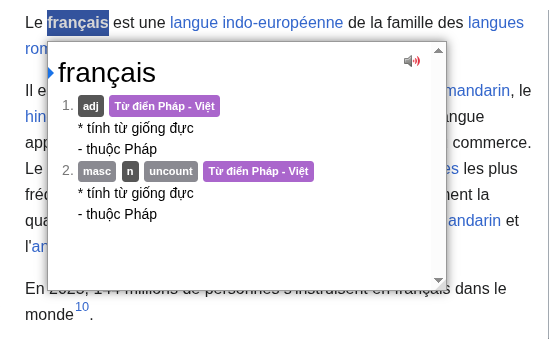
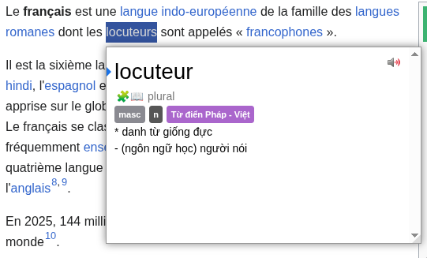

# Từ điển Pháp Việt cho Yomitan

Từ điển Pháp Việt cho [Yomitan](https://yomitan.wiki/) này được xây dựng dựa trên từ điển FVDP French-Vietnamese Dictionary và [Wikitionary French - English for Yomitan](https://yomidevs.github.io/kaikki-to-yomitan/)

[Tải xuống tại đây](tu-dien-phap-viet.zip)

Preview:

*tra từ bằng cách di chuột và giữ phím Shift*

*hỗ trợ nhận diện dạng số nhiều*

